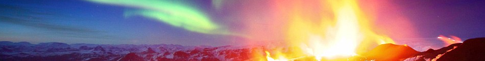

# Física III B - Primer semestre de 2019

**Asignatura de la carrera de Profesorado en Física [Universidad Nacional de Río Negro](http://www.unrn.edu.ar/ "UNRN")**

**Dr. Hernán Asorey**
***Departamento Física Médica, Centro Atómico Bariloche e Instituto Balseiro, Av. E. Bustillo 9500, (8400) San Carlos de Bariloche, Argentina***

### [Programa de la materia](https://gitlab.com/asoreyh/unrn-f3b/blob/master/materiales/PROGRAMA%20FISICA%20IIIB%20-%20PLAN%202016%20-%202019-2021.pdf)

### [Clases](https://gitlab.com/asoreyh/unrn-f3b/tree/master/clases)

### [Guías de ejercicios](https://gitlab.com/asoreyh/unrn-f3b/tree/master/guias)

### [Materiales](https://gitlab.com/asoreyh/unrn-f3b/tree/master/materiales)

## Objetivo

Construir un marco de trabajo conceptual sobre la termodinámica en general; los principios y leyes que regulan los mecanismos de transferencia de calor; y la importancia y problemas asociados a la termodinámica en la actualidad.

## Contenidos mínimos

Ideas alternativas en la termodinámica. El calor como transferencia de energía. El experimento de Joule. Modelo cinético. Temperatura, calor y energía interna.  Teoría cinética. Energía interna de un gas ideal. Calor específico. Calorimetría. Calor latente o cómo enfriar una bebida. Conducción, convección y radiación. 1° ley de la termodinámica. Metabolismo humano. La 2° ley de la termodinámica. Máquinas térmicas y refrigeradores. Entropía y la 2° ley. Disponibilidad de energía. Muerte térmica. Interpretación estadística de la entropía y de la 2° ley. Fuentes de energía. Contaminación térmica. Potenciales termodinámicos.

# Programa

## Primer módulo
**Del 06/Mar al 19/Abr** 

### [Unidad 1: El Calor](https://gitlab.com/asoreyh/unrn-f3b/tree/master/clases/u01)
**5 encuentros desde el 06/Mar hasta el 22/Mar**

El calor. Gases ideales y reales. Energía interna. Calorimetría. Calor específico. Teoría cinética de los gases. Temperatura: concepto macroscópico y microscópico. Cambios de fase y calor latente.

***Entrega guía 01: 29/Mar/2019 23:59, próximamente estará aquí el enlace***

### [Unidad 2: Primer Principio de la Termodinámica](https://gitlab.com/asoreyh/unrn-f3b/tree/master/clases/u02)
**6 encuentros desde el 25/Mar hasta el 19/Abr**

Calor y trabajo. Equivalente mecánico del calor. Experimento de Joule. Sistemas. Fuentes de calor. Potenciales termodinámicos. Primer principio. Flujo de calor. Muerte térmica. Máquinas térmicas. 

***Entrega guía 02: 26/Abr/2019 23:59, próximamente estará aquí el enlace***

## Segundo módulo
**Del 22/Abr al 21/Jun**

### [Unidad 3: Segundo Principio de la Termodinámica](https://gitlab.com/asoreyh/unrn-f3b/tree/master/clases/u03)
**9 encuentros desde el 22/Abr hasta el 22/May**

Ciclos termodinámicos. Ciclo de Carnot. Eficiencia de una máquina térmica. Segundo principio de la termodinámica. Postulados. Móviles perpetuos. Entropía. Interpretación micro y macroscópica de la entropía. La flecha temporal

***Entrega guía 03: 29/May/2019 23:59, próximamente estará aquí el enlace***

### [Unidad 4: Aplicaciones](https://gitlab.com/asoreyh/unrn-f3b/tree/master/clases/u04)
**8 encuentros desde el 23/May hasta el 21/Jun**

Transferencia de calor: radiación, conducción y convección. Ley de Newton. Conductores y aislantes del calor. Ley de Fourier. Aplicaciones hogareñas. Termodinámica de la vida. Energía y humanidad. Calentamiento global.

***Entrega guía 04: 26/Jun/2019 11:59, próximamente estará aquí el enlace***

## Bibliografía obligatoria y complementaria

* Paul A. Tipler y Gene Mosca, "Física para las Ciencias y la Tecnología", Volumen 1, cualquier edición
* Hugh Young y Roger Freeman, "Sears & Semansky - Física Universitaria", Volumen 1, cualquier edición
* Michael J. Moran y Howard N. Shapiro, "Fundamentos de Termodinámica Técnica", 2da Edición
* Cualquier libro de Termodinámica

## Evolución de la cursada

### Horarios:
* Martes 20:00 a 23:00.
* Jueves 18:00 a 20:00 

### Entrega de ejercicios seleccionados:
* Guía 01: 29/03/2019 23:59:59, ejercicios 5, 8, 14, 16 (opcional), 19 y 21.
* Guía 02: 26/04/2019 23:59:59, ejercicios 22, 27, 28, 29, 30, 32, 33, 35, 36 y 38. 
* Guía 03: 31/05/2019 23:59:59, ejercicios 39, 41, 43, 45, 47, 48 (opcional).
* Guía 04: 25/06/2019 23:59:59, ejercicios a partir del 25/06.

### Clases:

| **Clase** | **Modalidad** | **Fecha** |  **Hora** | **Contenidos** |
| :---:   | :---:     | :---: | :---: | :---         |
| U01C01 | Presencial | Mar 12/Mar/19 | 20:00-23:00 | Presentación, introducción, objetivos, metodología, contenidos mínimos, página web, clases presenciales y virtuales. Termodinámica, Calor, Temperatura, Principio Cero de la Termodinámica, Escalas de temperaturas |
| U01C02 | Presencial | Jue 14/Mar/19 | 18:00-20:00 | Gases ideales y reales; Teoría cinética de los gases; concepto de temperatura microscópica y macroscópica; deducción de la ecuación de estado de los gases ideales |
| U01C03 | Virtual | Mar 19/Mar/19 | 20:00-23:00 | Transformaciones; El diagrama P-V; Calor específico, Deducción para gases ideales | 
| U01C04 | Virtual | Jue 21/Mar/19 | 18:00-20:00 | Calor específico en sólidos, Ley de Dulong-Petite, Capacidad Calorífica, Sistema termodinámico, Frontera, Medio, Fases, Cambio de fases, Calor Latente y Calor sensible.|
|        |         |               |             | **Fin unidad 01** |
| U02C01 | Virtual | Mar 26/Mar/19 | 20:00-23:00 | Primer principio, transformación isoterma y adiabática | 
| U02C02 | Virtual | Jue 28/Mar/19 | 18:00-20:00 | Repaso U01 y consultas guía 01 |
| U02C03 | Virtual | Jue 04/Abr/19 | 18:00-20:00 | Sucesión de transformaciones. Ciclos. El ciclo triangular y el ciclo cuadrado. Intercambios de energía entre el sistema y el medio: calor y trabajo netos. Rendimiento |
| U02C04 | Presencial | Mar 09/Abr/19 | 20:00-23:00 | Proceso reversible. Ciclo de Carnot. Rendimiento del ciclo de Carnot. Enunciado del 1er teorema de Carnot. Máquina térmica: definición y ejemplos históricos. Máquina de Newcomen | 
| U02C05 | Presencial | Jue 11/Abr/19 | 18:00-20:00 | Watt. El regulador centrífugo. Primer motor de Watt. Mecanismo de Watt. La máquina de vapor de Watt. Trabajo Guía 02, problema 24. |
| U02C06 | Virtual | Mar 16/Abr/19 | 20:00-23:00 | Mejoras de Watt, la máquina de vapor de Watt, indicador de estado y diagrama PV, Ciclo Otto, Ciclo Diesel, muerte térmica, máquina frigorífica, ciclos combinados. |
|        |         |               |             | **Fin unidad 02** |
| U03C01 | Virtual | Mar 23/Abr/19 | 20:00-23:00 | Máquina frigorífica. La heladera. Segundo principio de la termodinámica. Enunciados de Clausius y Kelvin-Planck. Equivalencia. Irreversibilidad. Teorema de Carnot. Enunciado de Carnot. |
| U03C02 | Virtual | Jue 25/Abr/19 | 18:00-20:00 | consultas guía 02 |
| U03C03 | Virtual | Mar 30/Abr/19 | 20:00-23:00 | Desigualdad de Clausius. Entropía. La entropía como función de estado. Primera ecuación de Gibbs. |
| U03C04 | Virtual | Jue 02/May/19 | 18:00-20:00 | Transformaciones y cambios de entropía. Procesos isentrópicos. El diagrama T-S. Transformaciones en el diagrama T-S. Entropía en aumento. | 
| U03C05 | Presencial | Mar 07/May/19 | 20:00-23:00 | Entropía en aumento. Cambios de entropía del sistema, el medio y el universo. Cambio de entropía en una máquina térmica. El aumento de la entropía y el segundo principio. | 
| U03C06 | Presencial | Jue 09/May/19 | 18:00-20:00 | Cambio de entropía por congelamiento del agua. Trabajamos con la guía 03. |  
| U03C07 | Virtual | Mar 21/May/19 | 20:00-23:00 | Incremento de entropía del universo. La flecha temporal. Segundo principio, Entropía y temperatura absoluta. Interpretación microscópica de la entropía: macroestados y microestados. | 
| U03C08 | Virtual | Jue 23/May/19 | 18:00-20:00 | Interpretación microscópica de la entropía: macroestados y microestados. Definición de entropía de Boltzmann. Tercer principio. Móviles perpetuos. |  
| U03C09 | Virtual | Mar 28/May/19 | 20:00-23:00 | Consultas guía 03, ejercicios 39, 41, 42 y 44. | 
|        |         |               |             | **Fin unidad 03** |
| U04C01 | Virtual | Jue 30/May/19 | 18:00-20:00 | Procesos de transferencia de calor. Ley de enfriamiento. Ley de Newton. Conducción de calor: materiales aislantes y conductores.|

<!---
* 22, U03C03V, 20/06/2018: Procesos de transferencia de calor. Ley de Newton. Ley de enfriamiento. Conducción de calor. Conductividad térmica. Ley de Fourier. Resistencia térmica. Convección. Aplicaciones.

| U04C03 | Presencial | Mar 04/May/19 | 20:00-23:00 | Energía y humanidad: nuestro lugar en el Universo, nuestra avidez por el consumo de energía, consumo, desarrollo y fuentes de producción. |
| U04C04 | Presencial | Jue 06/May/19 | 18:00-20:00 | Energía y humanidad: consumo de combustibles fósiles. Emisión e evolución de la concentración de CO2. Efecto Invernadero. Gases de efecto invernadero. Cambio climático y calentamiento global. La huella de carbono. Reflexiones finales. |
| U04C05 | Virtual | Mar 11/Jun/19 | 20:00-23:00 | |
| U04C06 | Virtual | Jue 13/Jun/19 | 18:00-20:00 | |
| U04C07 | Virtual | Mar 18/Jun/19 | 20:00-23:00 | Consultas guía 04. Reflexiones finales |
|        |         |               |             | **Fin unidad 04** |
|        |         |               |             | **Fin del curso** |
-->

### Sobre las clases:

Las clases fueron realizados en [LibreOffice Impress](https://es.libreoffice.org/descubre/impress/), la herramienta de presentaciones de [LibreOffice](https://es.libreoffice.org/). Para poder visualizar correctamente las clases, por favor descárguelo siguiendo este enlace: **[Descargue LibreOffice](https://es.libreoffice.org/descarga/libreoffice-estable/)**. En Windows, puede ser necesario descargar también la fuente [Cabin](https://www.fontsquirrel.com/fonts/download/cabin). Para facilitar la difusión, se incluyen también versiones de las clases en formato pdf. Para visualizarlo, podría necesitar descargar [Acrobat Reader](https://get.adobe.com/es/reader).

### Licencia
**Física III B (Termodinámica)**, (c) por Hernán Asorey, 2018, 2019.
 
 Este trabajo se distribuye en forma gratuita bajo la licencia <a rel="license" href="http://creativecommons.org/licenses/by-nc-sa/4.0/deed.es">Licencia Creative Commons Attribution-NonCommercial-ShareAlike 4.0 International</a>. Debería haber recibido una copia de la licencia junto con este trabajo (cc-by-nc-sa-40-legalcode.txt). En su defecto, visite <a rel="license" href="http://creativecommons.org/licenses/by-nc-sa/4.0/deed.es">http://creativecommons.org/licenses/by-nc-sa/4.0/deed.es</a>.
